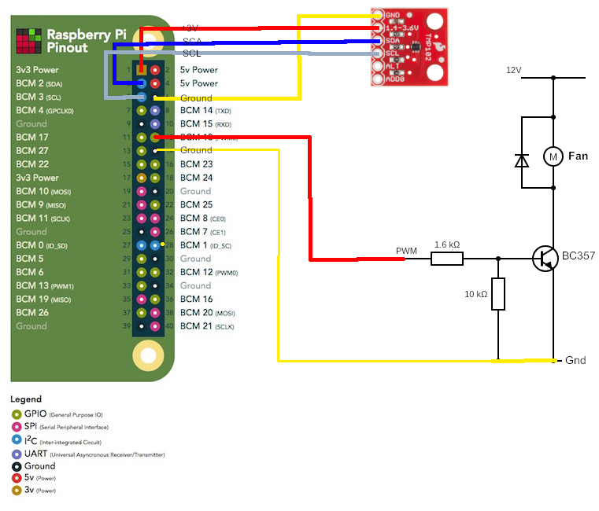

# Fan Controler
Shematic to conrol a Fam with the Raspberry Pi. 

## Circuit
To build the Circut you need a 10k Pull-Down Resistor, a 1.6k Base Resistor for the Transistor, a Transistor and a Diode.

For this Setup you need:
- a RPi 4
- tmp102 Temperature Sensor
- 1x 1.6k Ohm Resistor
- 1x 10k Ohm Resistor
- 1 BC357 Transistor
- 1 Diode (I think it doesn't really matter which one, the current is very low)
- 1x 12V Fan
- 1x 12V Power Supply

## Install
You need the following Python packages:

- Flask
- GPIO for RPi

Or you can use a Docker Container with the run-contrainer.sh Script.

## Setup
Configure the ports in the App.py File or inside the run-container.sh script to the ports you need for your service.

To run the Service, start App.py using `python3 App.py`. I recommend running this servie with Docker or nohup.

### Docker Usage
To run the Fan Control with Docker you can use the pre cooked script `build-contrainer.sh`. It will run the Dockerfile and create an Image for you. Then just use the pre cooked scrpit `run-contrainer.sh` and start it. Maybe you should lookup both scripts if you want to use different ports!

